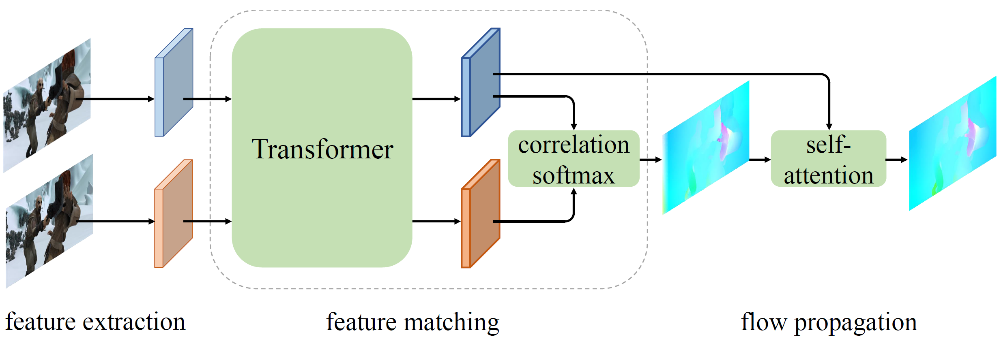
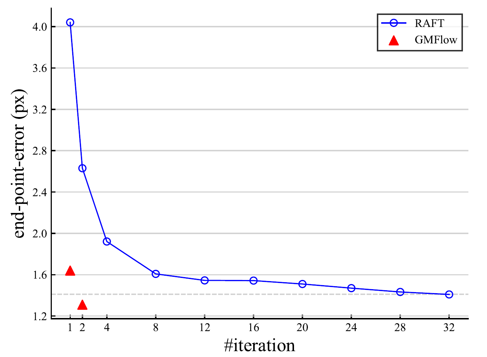

# GMFlow
GMFlow: Learning Optical Flow via Global Matching

Authors: Haofei Xu, [Jing Zhang](https://scholar.google.com.hk/citations?user=9jH5v74AAAAJ), [Jianfei Cai](https://jianfei-cai.github.io/), [Hamid Rezatofighi](https://scholar.google.com/citations?user=VxAuxMwAAAAJ), [Dacheng Tao](https://scholar.google.com/citations?user=RwlJNLcAAAAJ)

We streamline the optical flow estimation pipeline by reformulating optical flow as a global matching problem.

Comparison with RAFT:

**Coming soon!**

For any questions, please contact via email, thanks!

